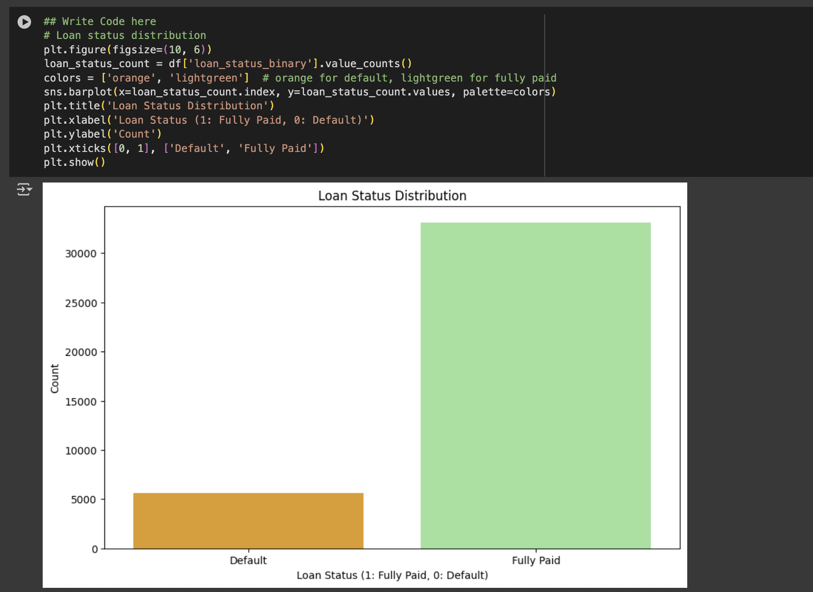

# Lending Club Loan Default Prediction System

## Executive Summary

This project implements a machine learning solution to automate loan approval decisions for Lending Club, a peer-to-peer lending platform. The system predicts loan default probability using historical borrower data, addressing critical business challenges in risk assessment and lending efficiency.

## Business Problem

Lending Club's manual underwriting process presents significant operational challenges:

**Primary Risks:**
- **Credit Risk**: Approving loans that subsequently default, resulting in financial losses
- **Opportunity Cost**: Rejecting creditworthy applicants, leading to missed revenue opportunities
- **Operational Inefficiency**: Manual review processes create bottlenecks and inconsistent decisions

**Solution Objective**: Develop a predictive model to accurately assess borrower default risk, enabling automated, data-driven lending decisions.

## Technical Approach

### Data Overview

The analysis leverages a dataset of approximately 38,000 historical loan applications with comprehensive borrower profiles and loan characteristics.

**Key Features:**
- **Loan Attributes**: Amount, interest rate, installment, term length
- **Borrower Profile**: Employment length, home ownership status, annual income
- **Credit Indicators**: Grade, debt-to-income ratio, revolving utilization rate
- **Verification Details**: Income verification status, loan purpose
- **Target Variable**: Loan status (Fully Paid vs Charged Off)

### Data Processing Pipeline

1. **Feature Engineering**
   - Removed non-predictive identifiers and metadata columns
   - Implemented systematic missing value treatment strategies
   - Applied appropriate encoding techniques for categorical variables
   - Standardized numerical features for model compatibility

2. **Exploratory Analysis**
   - Analyzed distribution patterns of loan defaults across segments
   - Identified key risk indicators through correlation analysis
   - Examined relationships between borrower characteristics and default rates
   - Validated feature importance through statistical testing

### Model Development

**Classification Algorithms Evaluated:**
- Logistic Regression (baseline model)
- Decision Tree Classifier
- Random Forest Classifier
- XGBoost Classifier

**Performance Metrics:**
- Classification Accuracy
- Precision and Recall
- F1-Score
- ROC-AUC Score
- Confusion Matrix Analysis

### Model Performance

The ensemble methods (Random Forest and XGBoost) demonstrated superior performance in balancing default detection accuracy with false positive minimization. These models effectively capture non-linear relationships and interaction effects in the data.

## Visual Analysis

### Loan Status Distribution


### Interest Rate Risk Analysis


### Credit Grade Performance


## Project Structure

```
loan-default-prediction/
├── Starter_Code_Loan_Approval_Lending_Club.ipynb  # Main analysis notebook
├── README.md                                       # Project documentation
├── screenshots/                                    # Visualization outputs
│   ├── loan_status_distribution.png
│   ├── loan_amount_vs_interest_rate.png
│   └── default_rate_by_grade.png
└── data/                                          # Dataset directory (optional)
```

## Technology Stack

**Core Technologies:**
- Python 3.x
- Jupyter Notebook

**Data Processing:**
- Pandas - Data manipulation and analysis
- NumPy - Numerical computing

**Visualization:**
- Seaborn - Statistical data visualization
- Matplotlib - Plotting library

**Machine Learning:**
- Scikit-learn - Model development and evaluation
- XGBoost - Gradient boosting framework

## Key Insights

- **Risk Segmentation**: Clear correlation between credit grades and default rates enables tiered pricing strategies
- **Income Verification**: Verified income applications show lower default rates, supporting enhanced verification processes
- **Loan Purpose**: Certain loan purposes exhibit higher risk profiles, informing targeted underwriting policies
- **Model Trade-offs**: Balancing precision and recall is critical for optimizing business outcomes

## Implementation Considerations

**Business Impact:**
- Reduced processing time from days to seconds
- Consistent risk assessment across all applications
- Data-driven pricing optimization
- Enhanced regulatory compliance through transparent decision criteria

**Technical Enhancements:**
- Implement SHAP or LIME for model interpretability
- Optimize hyperparameters using GridSearchCV or Bayesian optimization
- Address class imbalance through SMOTE or weighted loss functions
- Deploy production API using Flask or FastAPI
- Establish model monitoring and retraining pipelines

## Usage Instructions

1. Clone the repository
2. Install required dependencies: `pip install -r requirements.txt`
3. Open the Jupyter notebook: `jupyter notebook Starter_Code_Loan_Approval_Lending_Club.ipynb`
4. Execute cells sequentially to reproduce the analysis

## Contact Information

**Author**: Priyanka Bolem  
**Email**: priyankabolem@gmail.com  
**Phone**: 206.305.6760  
**LinkedIn**: [Profile](https://www.linkedin.com/in/priyanka-bolem-66763041/)

## License

This project is available for educational and research purposes. Please contact the author for commercial use inquiries.

---

*For questions, suggestions, or collaboration opportunities, please reach out via the contact information above.*